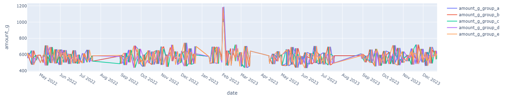
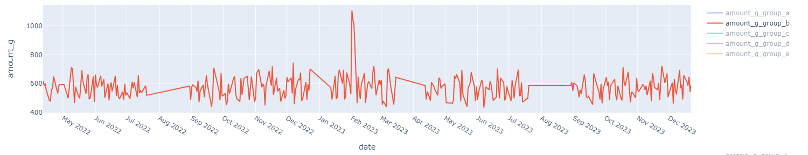

## 目次
- [目次](#目次)
- [改訂履歴](#改訂履歴)
- [リポジトリ概要](#リポジトリ概要)
- [リポジトリ作成の目的](#リポジトリ作成の目的)
- [入力と出力](#入力と出力)
- [ディレクトリ構成概要](#ディレクトリ構成概要)
- [ディレクトリ構成詳細](#ディレクトリ構成詳細)
- [v2\_analyzerパッケージ内機能詳細(主として使用している物を抜粋)](#v2_analyzerパッケージ内機能詳細主として使用している物を抜粋)
- [python version](#python-version)
- [使い方](#使い方)
- [configファイルについて](#configファイルについて)
- [入力データについて](#入力データについて)
- [出力グラフ例](#出力グラフ例)

## 改訂履歴
- ver1: commit: 46e20e118c92c51a5342616acb13369e645ad90a
- ver1との変更点
  - analyzerパッケージの廃止
  - config.jsonファイルの廃止
  - ローカルにcsvデータをすべてダウンロードした上で処理する方式の廃止
  - csvデータはDBへ登録し、DBからデータを読み出すよう変更
  - DBはpostgresqlを採用
  - グラフ表示は.pngファイル保存からブラウザ上で表示しグラフ領域を操作可能に変更

## リポジトリ概要
- [横須賀市の小学校の給食](https://www.city.yokosuka.kanagawa.jp/8345/kyuushoku/kyuusyoku-menu-open.html)についてのオープンデータを読み込み、前処理、グラフ出力をするパッケージ
- パッケージは作成中(現状はデータ読み込み→前処理→1種類のグラフ出力のみ)
- 最終的なイメージはデータ前処理、分析、予測、結果出力を一気通貫で可能なシステムにしたい

## リポジトリ作成の目的
- 目的
  - データ分析パッケージの開発を実践するため
- 分析対象データの選定理由
    - 横須賀市のオープンデータが取得しやすく、操作しやすい(csv)ため
    - 地域ごとにデータがあり、給食について地域差があるのか興味があり、調べたいため

## 入力と出力
- 入力
  - 1月分の地域ごとの学校給食献立csvデータ
  - データの中身は[入力データについて](#入力データについて)で説明する
- 出力
  - 全期間の地域ごとの学校給食献立データを前処理したものをグラフ化したpngデータ

## ディレクトリ構成概要
- school_lunch_analysis
  - v2_analyzer
    - データの取得、またはデータの可視化を実行するパッケージ

## ディレクトリ構成詳細
- v2_analyzer
  - main.py
    - 実行ファイル
  - get_menu
    - webサイトからcsvデータをスクレイピングで取得
    - 取得したデータの前処理
    - 前処理データをDBへ登録
  - settings
    - DB接続設定などを記述するファイルの保管
  - graphs
    - DBからデータを取得し、ブラウザ上でグラフ表示

## v2_analyzerパッケージ内機能詳細(主として使用している物を抜粋)
- get_menu: scrapyによるスクレイピングパッケージ
  - get_menu
    - spiders
      - menu_spider.py
        - スクレイピング実行ファイル
    - items.py
      - scrapyでpipelineに渡されるitemオブジェクトのフィールド指定
    - pipelines.py
      - スクレイプしたデータに対する各種処理のパイプライン
        - DBにデータが既に存在するか確認(存在する場合は前処理、DB登録を行わない)
        - データの前処理
        - DBへデータを登録
    - settings.py
      - スクレイプ条件やDB接続の設定
  - preparation: 前処理やDBテーブルの準備に関するディレクトリ
    - preprocessor.py
      - 各種の前処理方法を記述
    - table_base.py
      - DBに登録するテーブルの設定
- settings: 設定ファイル置き場
  - config.py
    - DB接続などを設定する設定ファイル
- graphs: グラフ表示に関するファイル置き場
  - get_data_from_db.py
    - DBからデータを取得する
  - make_graph.py
    - ブラウザ上でグラフ表示(plotlyを使用)

## python version
- python 3.11

## 使い方
1. webからダウンロードしたデータを保存するDB(postgreSQL)を準備する
2. settings/config.jsonにDB接続に関する値を設定する。設定方法は[configファイルについて](#configファイルについて)を参考に設定する
3. 以下のコマンドの順に実行する
   - python3 -m v2_analyzer getdata
     - [横須賀市の小学校の給食](https://www.city.yokosuka.kanagawa.jp/8345/kyuushoku/kyuusyoku-menu-open.html)からデータを取得する
     - 既にデータがDBに登録されているならば、DBに登録されていないデータ(最新データなど)が追加される
     - 前処理実行時に、csvファイル内のデータ入力範囲外に何らかのデータが存在した場合は、その情報を unkown_log というファイルに書き出し出力する
   - python3 -m v2_analyzer view
     - DBからデータを取得し、ブラウザ上にグラフを表示する
     - 凡例をクリックするとグラフの表示/非表示を切り替えられる
     - [出力グラフ例](#出力グラフ例)

## configファイルについて
- 以下にDB接続に関する値を設定する。DBはpostgresqlを使用する
    - POSTGRES_URI = 'postgresql://{user}:{pass}@{host}:{port}/{db_name}'
      - user: ユーザー名
      - pass: パスワード
      - host: ホスト名
      - port: ポート番号
      - db_name: データベース名
    - POSTGRES_FILENAME_TABLE = '{filename}'
      - filename: ダウンロードしたcsvファイル名を保存するテーブル名
        - データダウンロード時にダウンロードしたデータ名を記録する
        - DBへのデータ有無は、ダウンロードしたデータ名が既にこのダウンロードファイル名テーブルに登録されているか否かで判定する
    - POSTGRES_BASE_TABLE_NAME = '{menu}'
      - ダウンロードしたcsvファイルを保存するテーブル名の先頭文言
      - データは日付情報から元号の年度ごとにテーブルを分けて作成される
      - 先頭文言の後に'_元号_年度'のような添え字がついたテーブルが作成される
      - 例：令和4年度と令和5年度のデータをダウンロードした場合、以下のようにテーブルが分かれて作成され、それぞれデータが保存される
        - menu_r_4
        - menu_r_5

## 入力データについて
- 横須賀市の小学校5地域(a~e)における月ごとの献立表データ
- 命名規則
  - gakkoukyusyokuod0404a.csv
  - gakkoukyusyokuod0404b.csv
  - ...
  - od以下の0404a, 0404bが元号、月、地域グループ番号
  - 0404a: (04, 04, a) -> (元号、月、地域グループ番号)
- 構造
  - 日付、献立名と、献立に使用される材料とその分量、栄養を一覧にしている
  - 以下、構造例

| A日付 | 献立名 | 材料名 | 分量（g） | エネルギー （kcal） | たんぱく質 （g） | 脂質 （g） | ナトリウム （mg） |
| --- | --- | --- | --- | --- | --- | --- | --- |
| 2022/4/13 | カレーライス | 米 | 70 | 239 | 4.3 | 0.6 | 1 |
| 2022/4/13 | カレーライス | 麦 | 10 | 33 | 0.7 | 0.2 | 0 |
| 2022/4/13 | カレーライス | 油 | 0.3 | 3 | 0 | 0.3 | 0 |
| ... | ... | ... | ... | ... | ... | ... | ... |

## 出力グラフ例
- 出力例1: グラフエリア内のすべての折れ線グラフを表示

- 出力例2: 出力例1のグラフのうち、1つの折れ線グラフのみを表示

